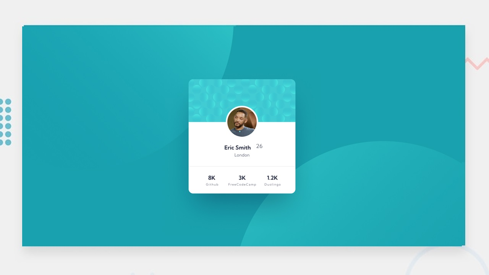

# Profile card component

## Table of contents

- [Welcome](#overview)
- [The challenge](#the-challenge)
- [Where to find everything](#where-to-find-everything)
  - [Using the Figma design file](#using-the-figma-design-file)
- [Building your project](#building-your-project)
  - [Built with](#built-with)
  - [What I learned](#what-i-learned)
  - [Continued development](#continued-development)
  - [Useful resources](#useful-resources)
- [Author](#author)
- [Acknowledgments](#acknowledgments)

## Welcome! 👋

Thanks for checking out this coding challenge.

**To do this challenge, you need a basic understanding of HTML and CSS and finished [this course](https://www.freecodecamp.org/learn/2022/responsive-web-design/learn-html-by-building-a-cat-photo-app/) and [this](https://www.freecodecamp.org/learn/2022/responsive-web-design/learn-basic-css-by-building-a-cafe-menu/) too.**

## The challenge

Your challenge is to build out this profile card component and get it looking as close to the design as possible.

You can use any tools you like to help you complete the challenge. So if you've got something you'd like to practice, feel free to give it a go.

Want some support on the challenge? [Join our Discussion section](https://github.com/orgs/dcTeam23/discussions/categories/q-a) and ask questions creating a new discussion with `q-a` label.

## Where to find everything

Your task is to build out the project to the designs inside the `/design` folder. You will find both a mobile and a desktop version of the design. 

The designs are in JPG static format. Using JPGs will mean that you'll need to use your best judgment for styles such as `font-size`, `padding` and `margin`. 

You will find all the required assets in the `/solution/images` folder. The assets are already optimized.

There is also a `design/style-guide.md` file containing the information you'll need, such as color palette and fonts.

### Using the Figma design file

> Download this [figma file](https://www.figma.com/file/TFKOPPXgxiSqBxfS8270xe/profile-card-component?type=design&node-id=0%3A1&mode=design&t=tX6KCjkZjiyFNgl4-1)

Using this [design file](https://www.figma.com/file/TFKOPPXgxiSqBxfS8270xe/profile-card-component?type=design&node-id=0%3A1&mode=design&t=tX6KCjkZjiyFNgl4-1) will help you practice building projects in the same way professionals do. Seeing the details in the design will help you improve your accuracy when building projects and build projects faster.

[Figma](https://www.figma.com/) is an extremely popular design tool that has a generous free tier and can also be used on both Windows and Mac computers.

To get started with Figma, [download the correct app for your operating system](https://www.figma.com/downloads/). 

If you haven't used Figma before, here are a couple of great resources to get you up to speed: 

- ["Everything Developers Need To Know About Figma' article on Smashing Magazine](https://www.smashingmagazine.com/2020/09/figma-developers-guide/)
- ["Learn Figma, an Introduction for developers](https://dev.to/gedalyakrycer/learn-figma-an-introduction-for-developers-54e3)

## Building your project

Follow these steps:

1. Fork this [GitHub repo](https://github.com/profile_card_challenge). Creating a repo will make it easier to share your code with the community if you need help.
2. This repos have alredy configured to deploy using Github Pages with PullRequest preview enabled.
3. Look through the designs to start planning out how you'll tackle the project. This step is crucial to help you think ahead for CSS classes to create reusable styles.
4. Before adding any styles, structure your content with HTML. Writing your HTML first can help focus your attention on creating well-structured content.
5. Write out the base styles for your project, including general content styles, such as `font-family` and `font-size`.
6. Start adding styles to the top of the page and work down. Only move on to the next section once you're happy you've completed the area you're working on.

## Overwrite `README.md` file

We strongly recommend overwriting this `README.md` with a custom one. We've provided a template inside the [`README.md`](./README.md) file in this starter code.

The template provides a guide for what to add. A custom `README` will help you explain your project and reflect on your learnings. Please feel free to edit our template as much as you like.

## Submitting your solution

Submit your solution with a simple Pull Request for this repository with `challenge-solution` label. 

Remember, if you're looking for feedback on your solution, be sure to ask questions when submitting it. The more specific and detailed you are with your questions, the higher the chance you'll get valuable feedback from the community!

## Got feedback?

I'll love receiving feedback! I'm always looking to improve our challenges and our course. So if you have anything you'd like to mention, please create a [`issue`](https://github.com/profile_card_challenge/issues/new) to improve it.

This challenge is completely free. Please share it with anyone who will find it useful for practice.

**Have fun building!** 🚀
